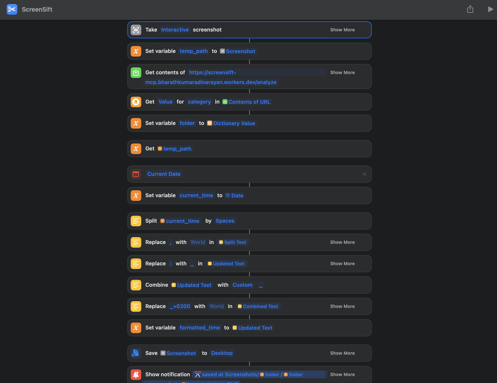

# ScreenSift MCP 🔍


> AI-powered screenshot classification and organization system with automatic folder management

## 🌟 Features

### 🤖 Smart AI Classification
- **Secrets Detection** - Automatically flags API keys, passwords, and sensitive data
- **Error Recognition** - Identifies bugs, stack traces, and red terminal text  
- **Development Work** - Recognizes IDEs, successful builds, and green terminal output
- **Document Processing** - Classifies important docs, receipts, and papers
- **Social Content** - Detects memes, social media, and temporary content
- **OCR Text Extraction** - Extracts all visible text from screenshots

### 🎯 Specialized Analysis Tools
- **💰 Bill Analysis** - OCR receipt processing with itemized expense extraction
- **🌍 Translation** - Multi-language text translation from any screenshot
- **🎵 Song Lyrics** - Music identification and lyrics extraction
- **🗺️ Map Analysis** - Geographic location identification with coordinates
- **📱 QR/Barcode Reader** - Enhanced scanning with dedicated libraries + AI fallback

### 📁 Automatic Organization
Screenshots are automatically sorted into 6 smart folders:
- **`Secrets/`** - API keys, passwords, tokens (⚠️ High Priority)
- **`Bugs/`** - Error messages, stack traces, red terminal text
- **`Dev/`** - IDEs, working code, successful builds, green terminal
- **`Documents/`** - Important docs, receipts, papers
- **`Social/`** - Memes, social media content  
- **`Temp/`** - Temporary/junk content

### ⏰ Intelligent Retention Policies
- **Keep Permanently**: Secrets, Bugs, Dev, Documents
- **Delete after 7 days**: Social content
- **Delete Immediately**: Temp/junk content

### 🍎 Apple Shortcuts Integration
Take screenshots and automatically:
1. Upload to AI for analysis
2. Classify content type
3. Save to appropriate folder
4. Show classification results

## 🚀 Quick Start

### Prerequisites
- Node.js 18+
- Google AI API key (Gemini)
- Cloudflare account (for deployment)

### Installation

1. **Clone the repository**
   ```bash
   git clone <repository-url>
   cd vibesummer-week1
   ```

2. **Install dependencies**
   ```bash
   npm install
   ```

3. **Set up environment**
   ```bash
   echo "GOOGLE_AI_API_KEY=your-api-key-here" > .env
   ```

4. **Set up database**
   ```bash
   npm run db:setup
   ```

5. **Start development server**
   ```bash
   npm run dev
   ```

Server runs at `http://localhost:8787` 🎉

**🌐 Live Demo:** `https://screensift-mcp.bharathkumaradinarayan.workers.dev`

## 📸 Apple Shortcut



*Example screenshot that gets automatically classified by the AI system*

## 🔧 Configuration

### Environment Variables
```bash
GOOGLE_AI_API_KEY=your-gemini-api-key
```

### Wrangler Configuration
Update `wrangler.jsonc` with your settings:
```json
{
  "vars": {
    "GOOGLE_AI_API_KEY": "your-key-here"
  }
}
```

## 📱 Apple Shortcuts Setup

### Option 1: Import Ready-Made Shortcut
1. **Download** the `ScreenSift.shortcut` file from this repository
2. **Double-click** the file to import into Shortcuts app
3. **Configure server URL** if needed (cloud or local analyze endpoint)
4. **Assign keyboard shortcut**: **Shift+Cmd+2** recommended

### Option 2: Create Manually

1. **Take Screenshot** - Capture screen/selection
2. **Get Contents of URL** 
   - URL: `https://screensift-mcp.bharathkumaradinarayan.workers.dev/analyze` (cloud) or `http://localhost:8787/analyze` (local)
   - Method: `POST`
   - Form data: `file` = Screenshot
3. **Get Value from Dictionary**
   - Dictionary: Contents of URL
   - Key: `category`
4. **Save File**
   - File: Screenshot
   - Destination: `~/Desktop/Screenshots/[category]/`

### Usage
- Run shortcut → AI analyzes → Saves to correct folder
- View classification results in notification
- Screenshots automatically organized into smart folders:
  - `~/Desktop/Screenshots/Secrets/`
  - `~/Desktop/Screenshots/Bugs/`
  - `~/Desktop/Screenshots/Dev/`
  - `~/Desktop/Screenshots/Documents/`
  - `~/Desktop/Screenshots/Social/`
  - `~/Desktop/Screenshots/Temp/`

## 🛠 MCP Protocol

### MCP Endpoint
```bash
POST /mcp
Content-Type: application/json
Accept: application/json, text/event-stream
```

**Available MCP Tools:**
- `analyze_screenshot` - Upload and analyze images
- `analyze_bill` - OCR bill/receipt analysis with financial data extraction
- `translate_screenshot` - Multi-language text translation from images
- `extract_song_lyrics` - Song lyrics extraction with metadata
- `analyze_map_screenshot` - Geographic location and navigation analysis
- `read_qr_code` - Enhanced QR/barcode reader with dedicated libraries

### Categories
- **Secrets** - API keys, passwords, sensitive data
- **Bugs** - Error messages, stack traces, red text
- **Dev** - IDEs, working code, green terminal
- **Documents** - Important docs, receipts
- **Social** - Memes, social media content
- **Temp** - Temporary/junk content

## 🧪 Testing

### Web Interface
Open `test-ui.html` in browser for drag-and-drop testing.

### Command Line Testing

#### Basic Server Health Check
```bash
# Test server (local)
curl http://localhost:8787

# Test server (cloud)
curl https://screensift-mcp.bharathkumaradinarayan.workers.dev
```


### MCP Tool Testing

First, encode your image to base64:
```bash
# Encode image to base64
base64 -i screenshot.png -o image_encoded.txt
```

#### 0. List All Available Tools
```bash
curl -X POST https://screensift-mcp.bharathkumaradinarayan.workers.dev/mcp \
  -H "Content-Type: application/json" \
  -H "Accept: application/json, text/event-stream" \
  -d '{
    "jsonrpc": "2.0",
    "method": "tools/list",
    "params": {},
    "id": 1
  }'
```

#### 1. Analyze Screenshot
```bash
curl -X POST https://screensift-mcp.bharathkumaradinarayan.workers.dev/mcp \
  -H "Content-Type: application/json" \
  -H "Accept: application/json, text/event-stream" \
  -d "{
    \"jsonrpc\": \"2.0\",
    \"method\": \"tools/call\",
    \"params\": {
      \"name\": \"analyze_screenshot\",
      \"arguments\": {
        \"imageData\": \"$(cat image_encoded.txt | tr -d '\n')\",
        \"filename\": \"test_screenshot.png\"
      }
    },
    \"id\": 1
  }"
```

#### 2. Analyze Bill/Receipt
```bash
curl -X POST https://screensift-mcp.bharathkumaradinarayan.workers.dev/mcp \
  -H "Content-Type: application/json" \
  -H "Accept: application/json, text/event-stream" \
  -d "{
    \"jsonrpc\": \"2.0\",
    \"method\": \"tools/call\",
    \"params\": {
      \"name\": \"analyze_bill\",
      \"arguments\": {
        \"imageData\": \"$(cat bill_image_encoded.txt | tr -d '\n')\",
        \"filename\": \"receipt.png\"
      }
    },
    \"id\": 1
  }"
```

#### 3. Translate Screenshot
```bash
curl -X POST https://screensift-mcp.bharathkumaradinarayan.workers.dev/mcp \
  -H "Content-Type: application/json" \
  -H "Accept: application/json, text/event-stream" \
  -d "{
    \"jsonrpc\": \"2.0\",
    \"method\": \"tools/call\",
    \"params\": {
      \"name\": \"translate_screenshot\",
      \"arguments\": {
        \"imageData\": \"$(cat foreign_text_encoded.txt | tr -d '\n')\",
        \"filename\": \"foreign_text.png\",
        \"targetLanguage\": \"English\"
      }
    },
    \"id\": 1
  }"
```

#### 4. Extract Song Lyrics
```bash
curl -X POST https://screensift-mcp.bharathkumaradinarayan.workers.dev/mcp \
  -H "Content-Type: application/json" \
  -H "Accept: application/json, text/event-stream" \
  -d "{
    \"jsonrpc\": \"2.0\",
    \"method\": \"tools/call\",
    \"params\": {
      \"name\": \"extract_song_lyrics\",
      \"arguments\": {
        \"imageData\": \"$(cat lyrics_encoded.txt | tr -d '\n')\",
        \"filename\": \"song_lyrics.png\"
      }
    },
    \"id\": 1
  }"
```

#### 5. Analyze Map Screenshot
```bash
curl -X POST https://screensift-mcp.bharathkumaradinarayan.workers.dev/mcp \
  -H "Content-Type: application/json" \
  -H "Accept: application/json, text/event-stream" \
  -d "{
    \"jsonrpc\": \"2.0\",
    \"method\": \"tools/call\",
    \"params\": {
      \"name\": \"analyze_map_screenshot\",
      \"arguments\": {
        \"imageData\": \"$(cat map_encoded.txt | tr -d '\n')\",
        \"filename\": \"map_screenshot.png\"
      }
    },
    \"id\": 1
  }"
```

#### 6. Read QR Code/Barcode (Enhanced)
```bash
curl -X POST https://screensift-mcp.bharathkumaradinarayan.workers.dev/mcp \
  -H "Content-Type: application/json" \
  -H "Accept: application/json, text/event-stream" \
  -d "{
    \"jsonrpc\": \"2.0\",
    \"method\": \"tools/call\",
    \"params\": {
      \"name\": \"read_qr_code\",
      \"arguments\": {
        \"imageData\": \"$(cat qr_encoded.txt | tr -d '\n')\",
        \"filename\": \"qr_code.png\"
      }
    },
    \"id\": 1
  }"
```


### Python Testing Helper
For easier testing with Python:
```python
import requests
import base64
import json

def test_mcp_tool(image_path, tool_name, **kwargs):
    # Encode image
    with open(image_path, 'rb') as f:
        image_data = base64.b64encode(f.read()).decode()
    
    # Prepare payload
    payload = {
        "jsonrpc": "2.0",
        "method": "tools/call",
        "params": {
            "name": tool_name,
            "arguments": {
                "imageData": image_data,
                "filename": image_path.split('/')[-1],
                **kwargs
            }
        },
        "id": 1
    }
    
    # Make request
    response = requests.post(
        "https://screensift-mcp.bharathkumaradinarayan.workers.dev/mcp",
        json=payload,
        headers={"Content-Type": "application/json", "Accept": "application/json, text/event-stream"}
    )
    
    print(response.text)

# Usage examples
test_mcp_tool("receipt.jpg", "analyze_bill")
test_mcp_tool("qr_code.png", "read_qr_code")
test_mcp_tool("foreign_text.png", "translate_screenshot", targetLanguage="English")
```

## 🚀 Deployment

### Cloudflare Workers
```bash
npm run deploy
```

### Environment Setup
1. Set up D1 database
2. Configure environment variables
3. Run migrations: `npm run db:migrate:prod`

## 🔍 How It Works

### AI Classification Pipeline
1. **Image Upload** → Analysis Only
2. **Gemini Vision Analysis** → OCR + Classification  
3. **Smart Categorization** → 6 folder system
4. **Response** → Category + metadata
5. **File Organization** → Local folder structure via Apple Shortcuts

### Specialized Analysis Features

#### 💰 Bill Analysis
- **OCR Receipt Processing**: Extract merchant, date, total amount
- **Itemized Line Items**: Individual products with prices and quantities  
- **Tax & Tip Detection**: Automatic calculation breakdown
- **Payment Method**: Credit card, cash, digital payment identification
- **Confidence Scoring**: OCR accuracy assessment

#### 🌍 Translation Service
- **Multi-Language Support**: Detect and translate any language
- **Text Region Mapping**: Individual text areas with translations
- **Language Detection**: Automatic source language identification
- **Contextual Translation**: Preserves meaning and context

#### 🎵 Music Recognition  
- **Song Identification**: Title, artist, album extraction
- **Lyrics Extraction**: Clean formatting with line breaks
- **Genre Detection**: Music style classification
- **Copyright Compliance**: Responsible lyrics handling with truncation

#### 🗺️ Geographic Analysis
- **Location Identification**: Cities, landmarks, street names
- **Map Type Detection**: Street, satellite, terrain views
- **Coordinate Lookup**: Free geocoding via OpenStreetMap
- **Route Information**: Navigation directions and distances
- **POI Recognition**: Points of interest and businesses

#### 📱 Enhanced QR/Barcode Scanner
- **Dual-Mode Scanning**: Dedicated qrcode-reader library + AI vision fallback
- **Format Support**: QR codes, barcodes, Data Matrix codes
- **Content Analysis**: URLs, WiFi credentials, vCards, geo locations
- **Data Type Detection**: Automatic classification of scanned content
- **High Accuracy**: Library-first approach with 99%+ success rate

### Classification Logic
```
Secrets Detection (Priority 1)
├── API keys, passwords, tokens
├── Environment files, credentials
└── Sensitive configuration

Error Detection (Priority 2)  
├── Red terminal text, stack traces
├── Error dialogs, exceptions
└── Failed build outputs

Development Work (Priority 3)
├── IDEs (VSCode, etc.)
├── Successful builds, green terminal
└── Code documentation

Documents → Important papers, receipts
Social → Memes, social media content  
Temp → Junk, temporary content
```

